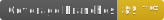
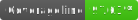
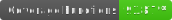

<h1 align="center">
   
  
   
  Hub Digital
   
</h1>

<h4 align="center">
  O Hub é a Home Page do Positivo On. Este repositório serve, de maneira unificada, todas as soluções didáticas oferecidas ao usuário em uma única página.
  ⚡️🔥
</h4>

 

  

  
  

  

 

  
  
  
  

