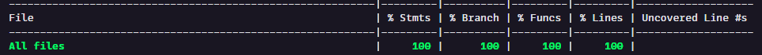

# Começando com os testes


## Testes automatizados

> Esta documentação se concentra nas estratégias criação de teste unitários de funções — react-redux, redux-saga etc. — e end-to-end dos componentes e páginas React presentes no Hub.

## Tecnologias utilizadas

Adotamos o [React Testing Library](https://testing-library.com/docs/react-testing-library/intro/) integrado com o [Jest](https://jestjs.io/docs/getting-started) para a escrita dos testes, além de utilizar o auxílio da [Redux mock store](https://github.com/reduxjs/redux-mock-store) .

## Executando os testes

Há alguns scripts disponíveis para a execução dos testes dentro do projeto, com estes comandos rodados através do terminal, todos os testes serão executados. Um relatório será disponibilizado ao fim da execução, informando os testes que passaram/falharam. Veja abaixo como acionar cada um deles:

**Para executar todos os testes**

Para executar todos os testes

```bash
$ npm run test
```

ou

```bash
$ yarn test
```

**NOTA: Por convenção da equipe, a partir daqui será demonstrado somente a execução utilizando o `yarn`, mas tenha em mente que todos os testes também podem ser rodados através do `npm run $script`.**

**Para executar somente os testes dos arquivos que sofreram alguma modificação**

```bash
$ yarn test:watch
```

Este comando não para a execução dos testes enquanto não solicitada. Ele monitora os arquivos que estão sendo alterados e executa os testes que impactam naquela modificação, além de disponibilizar relatório de coverage ao fim da execução.

**Para obter relatórios completos**

```bash
$ yarn test:coverage
```

Com teste comando sendo executado, começa-se a se gerar um arquivo de Coverage do projeto. Ele permitirá que seja observado um relatório mais completo a respeito dos testes, como por exemplo:

- Linhas não cobertas pelos testes;
- Ramificações (if, else, lógicas, etc.) não testadas;
- Cobertura total do código.

Esta imagem demonstra [o ultimo ponto citado acima]().



_Comando executado: `yarn test:coverage`_

**IMPORTANTE:**

É possível visualizar o coverage dos testes através de uma interface HTML disponível no diretório `coverage` que se encontra na raiz do projeto. Esta pasta é gerada/atualizada no momento em que o script `test:coverage` é executado.
